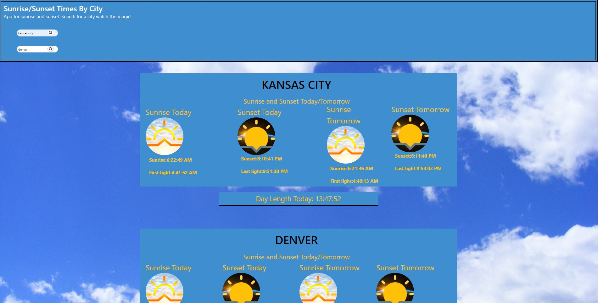

# Sunrise and sunset app

## Description

Provide a short description explaining the what, why, and how of your project. Use the following questions as a guide:

- What was your motivation? - As a user traveling through time zones i would like to know when the sun rises and when the sun sets in the city im currently in and the city im traveling too. 
- Why did you build this project? (Note: the answer is not "Because it was a homework assignment.")- This project was built for users traveling city to city with deferent time zones, i want to quickly be able to check the time from one or two inputs. 
- What problem does it solve?- Traveling from timezones throughout the day can sometimes be confusing and as developers we wanted to create an app that quickly renders out the city time zones from where you are to where you'll end up.
- What did you learn?- everything

## Table of Contents

- [Installation](#installation)
- [Usage](#usage)
- [Credits](#credits)
- [License](#license)

## Installation

No installation needed.

## Link to site
 https://garciajv86.github.io/SunsetSunriseTimes/

## Screenshot

## Credits

Alex Marquez, Joshua Garcia, Kyla Wise, Patrick McPartland

## License

MIT LICENSE

## Badges

## Features

- Able to search current city
- Able to  search planned destination city
- Able to search last city searched for previous searched for both current city and destination city and click the button for quick search